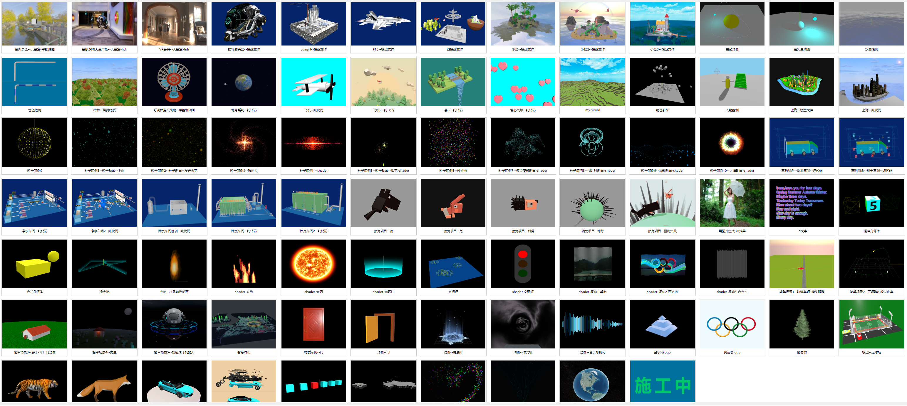

# vue3 + threejs

#

#### 1. 演示项目, 主要针对初学者学习 vue3 和 threejs
#### 2. 项目使用 ts, 基本的 vue组件都有, axios, pinia
#### 3. 有本人个人常用写好的样式文件包sass样式, 自定义的常用组件 等, 封装为插件方式引用
#### 4. 所有依赖包对当前时间 2024-05-30 都是较新或最新版本号
#### 5. threejs案例部分自己写的, 部分来自网络案例经过重构, 以对象方式封装
#### 6. 案例尽量找以代码建模案例, 方便学习, 引入3D模型文件的只做个别案例演示
#### 7. 目前案例较少, 本人自己项目还有一些案例会开源, 代码要做些调整, 后续慢慢添加上来
#### 8. 各种方式收集的案例, 原作者和来源当时没记, 所有非本人写的案例只标注了来源网络, 未写原作者名
#### 9. 如果打开有黑屏或白屏现象可能模型文件较大, 请稍等, 后续会优化代码加上加载进度条, 长时间等待无果请刷新页面

#

### 本地运行
```bash
// 克隆项目
git clone https://gitee.com/gitee18247670551/demo3d-20240529.git

// 安装依赖包
npm install

// 运行项目
npm run dev
```

#
### 在线体验
### http://demo3d.ycrlkj.com/

#
#### 示例总览



#
#### 示例: 天空盒
##### 来源网络


#
#### 示例: ***
##### 来源网络


#
#### 示例: vr看房
##### 来源网络


#
#### 示例: 损坏的头盔
##### 来源网络, 模型文件


#
#### 示例: csmart
##### 来源网络, 模型文件


#
#### 示例: F18
##### 来源网络, 模型文件


#
#### 示例: 小岛
##### 来源网络, glb文件


#
#### 示例: 小岛2
##### 来源网络, glb文件


#
#### 示例: 小岛3
##### 来源网络, glb文件


#
#### 示例: 曲线动画
##### 来源网络, 重构


#
#### 示例: 萤火虫动画
##### 来源网络, 重构


#
#### 示例: 水面简例
##### 本人编写


#
#### 示例: 管道简例
##### 本人编写


#
#### 示例: 树林
##### 本人编写


#
#### 示例: 风扇
##### 来源网络


#
#### 示例: 地月


#
#### 示例: 飞机
##### 本人编写, 参照网络案例原模型, 以对象方式重写, 纯代码


#
#### 示例: 飞机2
##### 本人编写, 参照网络案例原模型, 以对象方式重写, 纯代码


#
#### 示例: 瀑布
##### 本人编写, 参照网络案例原模型, 以对象方式重写, 纯代码


#
#### 示例: 爱心气球
##### 来源网络, 纯代码


#
#### 示例: 上海--模型文件
##### 来源网络


#
#### 示例: 上海
##### 来源网络, 出自稀土掘金 作者 Funky_Tiger
##### 本人重构, 原代码threejs版本较低, 改为最新版本164, 弯曲的楼贴图有bug, 代码中有标出
##### 原地址 https://juejin.cn/post/6844903957416902669


#
#### 示例: 粒子简例0
##### 本人编写


#
#### 示例: 粒子简例1--粒子动画--下雨
##### 来源网络, 重构


#
#### 示例: 粒子简例2--粒子动画--漫天雪花
##### 来源网络, 重构


#
#### 示例: 粒子简例3--银河系
##### 来源网络, 重构


#
#### 示例: 粒子简例4--shader
##### 来源网络, 重构


#
#### 示例: 粒子简例5--粒子动画-烟花-shader
##### 来源网络, 重构


#
#### 示例: 粒子简例6--粒子动画-彩虹雨
##### 来源网络, 重构


#
#### 示例: 粒子简例7--粒子动画-shader
##### 本人编写


#
#### 示例: 粒子简例8--粒子动画-倒计时-shader
##### 本人编写


#
#### 示例: 粒子简例9--波形动画-shader
##### 来源网络, 博客园 作者 郭先生的博客
##### https://www.cnblogs.com/vadim-web/p/13444198.html


#
#### 示例: 粒子简例10--太阳动画-shader
##### 来源网络, csdn 作者 Jedi Hongbin
##### https://blog.csdn.net/printf_hello/article/details/127901103


#
#### 示例: 车辆消杀-清消车间
##### 本人编写, 纯代码, 以对象方式调用动画


#
#### 示例: 车辆消杀-烘干车间
##### 本人编写, 纯代码, 以对象方式调用动画


#
#### 示例: 净水车间
##### 本人编写, 纯代码, 以对象方式调用动画


#
#### 示例: 除臭车间简例
##### 本人编写, 纯代码, 以对象方式调用动画


#
#### 示例: 除臭车间
##### 本人编写, 纯代码, 以对象方式调用动画


#
#### 示例: 除臭车间2
##### 本人编写, 纯代码, 以对象方式调用动画


#
#### 示例: 我的世界随机地图
##### 来源网络, csdn 作者 X01动力装甲
##### https://webgl.blog.csdn.net/article/details/83965754


#
#### 示例: 物理引擎
##### 来源网络


#
#### 示例: 人物控制
##### 来源网络


#
#### 示例: 除臭车间2
##### 本人编写, 纯代码, 以对象方式调用动画


#
#### 示例: 狼兔项目--狼--纯代码
##### 网络收集, 本人重构失败, 拆出模型


#
#### 示例: 狼兔项目--兔--纯代码
##### 网络收集, 本人重构失败, 拆出模型


#
#### 示例: 狼兔项目--刺猬--纯代码
##### 网络收集, 本人重构失败, 拆出模型


#
#### 示例: 狼兔项目--地球--纯代码
##### 网络收集, 本人重构失败, 拆出模型


#
#### 示例: 狼兔项目
##### 网络收集, 最新版three加ts对象像封装失败, 原版代码在路径中


#
#### 示例: 图片加3D效果, shader, 随便生成的景深图, 效果不好
##### 本人编写


#
#### 示例: 3d文字
##### 本人编写


#
#### 示例: 缓冲几何体
##### 本人编写


#
#### 示例: 合并几何体
##### 本人编写


#
#### 示例: 流光墙
##### 网络收集


#
#### 示例: 火焰


#
#### 示例: 火焰2


#
#### 示例: 原始着色器--波动


#
#### 示例: 光环柱--shader


#
#### 示例: 点标记
#### 来源 csdn 作者 焦焦焦焦焦
#### https://blog.csdn.net/weixin_60645637/article/details/135520320


#
#### 示例: 简单场景1--轨迹车辆, 镜头跟随


#
#### 示例: 简单场景2--过山车, 可调整轨道


#
#### 示例: 简单场景3--房子, 有开门动画


#
#### 示例: 简单场景4--鬼屋
#### 来源: csdn 作者 sayid760
#### https://blog.csdn.net/qq_14993375/article/details/125240762


#
#### 示例: 材质示例1


#
#### 示例: 动画--门


#
#### 示例: 动画--魔法阵
#### 来源: csdn 作者 ~在水一方
#### https://blog.csdn.net/qq_40147088/article/details/128418022


#
#### 示例: 动画--时光机
#### 来源: 稀土掘金 作者 zxg_神说要有光
#### https://juejin.cn/post/7258319655285178428


#
#### 示例: 动画--音乐可视化
#### 来源: 稀土掘金 作者 zxg_神说要有光
#### https://mp.weixin.qq.com/s?__biz=Mzg3OTYzMDkzMg==&mid=2247486665&idx=1&sn=6dee71f9b99c49c89590174a24a8a96e&chksm=cf00c3f2f8774ae46dcbc886fded5c36a835730d2c0813975864c3a9faa1748c106886733e53&token=475014312&lang=zh_CN#rd


#
#### 示例: 金字塔logo


#
#### 示例: 奥运会logo


#
#### 示例: 模型--老虎-模型动画


#
#### 示例: 模型--狐狸-模型动画


#
#### 示例: 射线选中物体


#
#### 示例: 俄乌战争
##### 网络收集


#
#### 示例: canvas1--绚丽粒子炸裂效果
##### 来源网络


#
#### 示例: canvas2--字母喷泉
##### 来源网络


# 源码文件夹

#### 1. 网络上搜集来的源码没保留原作者注释或信息, 网络案例大多都比较老旧, threejs新版本与旧版本改动较大, 本项目整理过的网络案例, 源码经过重构, 改成ts, 改成对象化
#### 2. 无意抄袭删除原作者, 如果介意, 请留言, 本人会添加原作者信息或删除
#### 3. 本项目 _doc 目录下, 附上了本人搜集来的网络案例源码包, 如有侵权, 请联系本人删除
#### 4. 附带的网络案例, 如果有兴趣重构并愿意开源重构后代码的(最好是基于three最新版本号, ts, 对象化封装), 可以加qq好友402337325共同学习, 更新代码