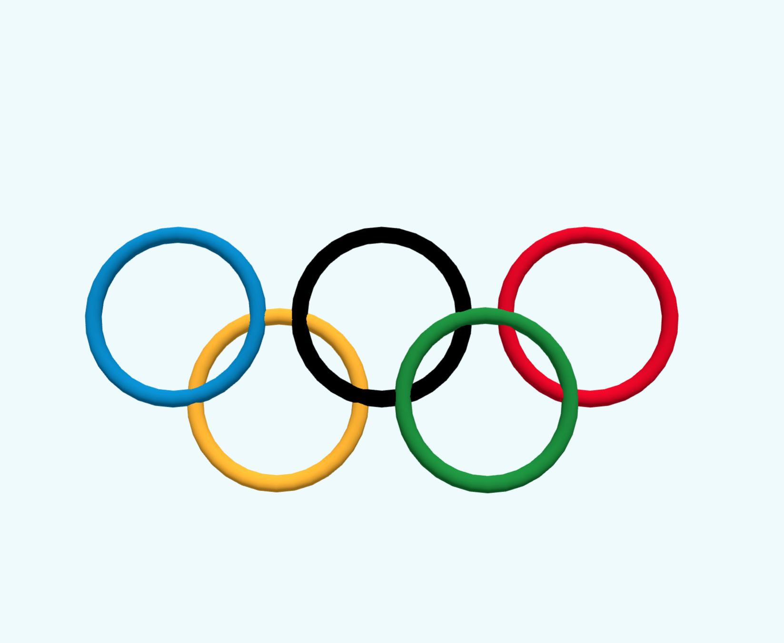

# vue3 + threejs

#

#### 1. 演示项目, 主要针对初学者学习 vue3 和 threejs
#### 2. 项目使用 ts, 基本的 vue组件都有, axios, pinia
#### 3. 有本人个人常用写好的样式文件包sass样式, 自定义的常用组件 等, 封装为插件方式引用
#### 4. 所有依赖包对当前时间 2024-05-30 都是较新或最新版本号
#### 5. threejs案例部分自己写的, 部分来自网络案例经过重构, 以对象方式封装
#### 6. 案例尽量找以代码建模案例, 方便学习, 引入3D模型文件的只做个别案例演示
#### 7. 目前案例较少, 本人自己项目还有一些案例会开源, 代码要做些调整, 后续慢慢添加上来
#### 8. 各种方式收集的案例, 原作者和来源当时没记, 所有非本人写的案例只标注了来源网络, 未写原作者名
#### 9. 如果打开有黑屏或白屏现象可能模型文件较大, 请稍等, 后续会优化代码加上加载进度条, 长时间等待无果请刷新页面

#

### 本地运行
```bash
// 克隆项目
git clone https://gitee.com/gitee18247670551/demo3d-20240529.git

// 安装依赖包
npm install

// 运行项目
npm run dev
```

#
### 在线体验
### http://demo3d.ycrlkj.com/

#
#### 示例总览


#
#### 示例: 天空盒
#### 单贴图


#
#### 示例: 天空盒-房间3d


#
#### 示例: 天空盒-皇家滨海大道广场
#### hdr材质


#
#### 示例: 模型-球形机器人


#
#### 示例: 模型-小岛1


#
#### 示例: 模型-小岛2


#
#### 示例: 模型-小岛3


#
#### 示例: csmart


#
#### 示例: 模型-损坏的头盔


#
#### 示例: 模型-风扇


#
#### 示例: 模型-F18


#
#### 示例: 模型-足球场


#
#### 示例: 模型-老虎


#
#### 示例: 模型-狐狸


#
#### 示例: 模型-小米su7


#
#### 示例: 模型-一些模型文件


#
#### 示例: 粒子-简单示例1


#
#### 示例: 粒子-下雨


#
#### 示例: 粒子-雪花


#
#### 示例: 粒子-银河系


#
#### 示例: 粒子-shader1


#
#### 示例: 粒子-烟花


#
#### 示例: 粒子-彩虹雨


#
#### 示例: 粒子-倒计时


#
#### 示例: 粒子-波动
##### 来源网络, 作者 郭先生的博客
##### https://www.cnblogs.com/vadim-web/p/13444198.html


#
#### 示例: 粒子-太阳
##### 来源网络, csdn 作者 Jedi Hongbin
##### https://blog.csdn.net/printf_hello/article/details/127901103


#
#### 示例: 缓冲几何体


#
#### 示例: 合并几何体


#
#### 示例: 3d文字


#
#### 示例: 树林
#### 树木全是精灵材质


#
#### 示例: 金字塔logo


#
#### 示例: 奥运会logo


#
#### 示例: 简易树
#### 由多个平面贴图交叉生成


#
#### 示例: 用图片生成3D效果
#### 景深图片是随意生成的, 效果不好


#
#### 示例: 材质示例-门


#
#### 示例: 房子, 有开门动画


#
#### 示例: 动画--门


#
#### 示例: 动画--魔法阵
#### 来源: csdn 作者 ~在水一方
#### https://blog.csdn.net/qq_40147088/article/details/128418022


#
#### 示例: 动画--时光机
#### 来源: 稀土掘金 作者 zxg_神说要有光
#### https://juejin.cn/post/7258319655285178428


#
#### 示例: 动画--音乐可视化
#### 来源: 稀土掘金 作者 zxg_神说要有光
#### https://mp.weixin.qq.com/s?__biz=Mzg3OTYzMDkzMg==&mid=2247486665&idx=1&sn=6dee71f9b99c49c89590174a24a8a96e&chksm=cf00c3f2f8774ae46dcbc886fded5c36a835730d2c0813975864c3a9faa1748c106886733e53&token=475014312&lang=zh_CN#rd


#
#### 示例: 动画--流光墙


#
#### 示例: 动画--火焰
#### 关键帧动画


#
#### 示例: 动画--点标记
#### 来源 csdn 作者 焦焦焦焦焦
#### https://blog.csdn.net/weixin_60645637/article/details/135520320


#
#### 示例: 动画--地月系统


#
#### 示例: 动画--萤火虫


#
#### 示例: 动画--曲线运动


#
#### 示例: 动画--管道流动


#
#### 示例: 动画--飞机


#
#### 示例: 动画--俄乌战争


#
#### 示例: 动画--爆炸效果


#
#### 示例: shader-火焰


#
#### 示例: shader-太阳
#### 用最新版three重写失败, 附上作者原文
#### 来源 ice-图形学社区 作者 Jsonco
#### https://www.icegl.cn/ask/article/28.html


#
#### 示例: shader-光环柱


#
#### 示例: shader-交通灯
#### 来源 郭先生的博客
#### https://cloud.tencent.com/developer/article/1689743?from_column=20421&from=20421


#
#### 示例: shader-波动1


#
#### 示例: shader-波动2


#
#### 示例: shader-波动3


#
#### 示例: 瀑布


#
#### 示例: 爱心气球


#
#### 示例: 上海
##### 来源网络, 出自稀土掘金 作者 Funky_Tiger
##### 本人重构, 原代码threejs版本较低, 改为最新版本164, 弯曲的楼贴图有bug, 代码中有标出
##### 原地址 https://juejin.cn/post/6844903957416902669


#
#### 示例: my-world
##### 来源网络, csdn 作者 X01动力装甲
##### https://webgl.blog.csdn.net/article/details/83965754


#
#### 示例: 物理引擎


#
#### 示例: 人物控制


#
#### 示例: 烘干车间


#
#### 示例: 洗消车间


#
#### 示例: 净水车间


#
#### 示例: 净水车间2


#
#### 示例: 除臭车间简例


#
#### 示例: 除臭车间


#
#### 示例: 除臭车间2


#
#### 示例: 镜头跟随


#
#### 示例: 射线选中物体


#
#### 示例: 过山车
#### 可编辑轨道


#
#### 示例: 鬼屋
#### 来源: csdn 作者 sayid760
#### https://blog.csdn.net/qq_14993375/article/details/125240762


#
#### 示例: 智慧城市


#
#### 示例: 游戏-飞机


#
#### 示例: 游戏-狼兔游戏--狼


#
#### 示例: 游戏-狼兔游戏--兔


#
#### 示例: 游戏-狼兔游戏--刺猬


#
#### 示例: 游戏-狼兔游戏--地球


#
#### 示例: 游戏-狼兔游戏
#### 用最新版three重构失败


#
#### 示例: cesium-简例
#### cesium.js 的一个简单示例


#
#### 示例: canvas-绚烂粒子特效


#
#### 示例: canvas-字母喷泉


# 源码文件夹

#### 1. 网络上搜集来的源码没保留原作者注释或信息, 网络案例大多都比较老旧, threejs新版本与旧版本改动较大, 本项目整理过的网络案例, 源码经过重构, 改成ts, 改成对象化
#### 2. 无意抄袭删除原作者, 如果介意, 请留言, 本人会添加原作者信息或删除
#### 3. 本项目 _doc 目录下, 附上了本人搜集来的网络案例源码包, 如有侵权, 请联系本人删除
#### 4. 附带的网络案例和本人重构失败案例, 如果有兴趣重构(基于three最新版本, ts对象化封装)并愿意开源的, 可以加qq好友402337325共同学习, 更新代码